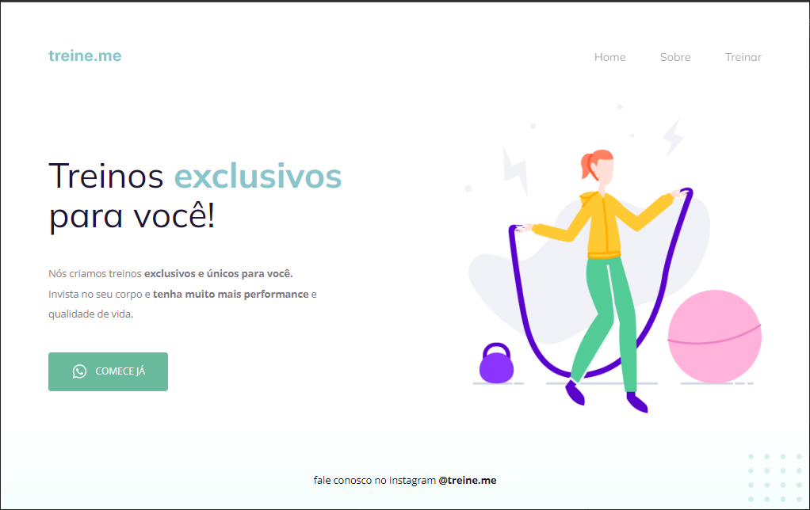

<h1 align="center"> Project 02 - Explorer </h1>

Projeto desenvolvido no Stage 02 do programa Explorer da Rocketseat 🚀

  <a href="#-tecnologias">Tecnologias</a>&nbsp;&nbsp;&nbsp;|&nbsp;&nbsp;&nbsp;
  <a href="#-projeto">Projeto</a>&nbsp;&nbsp;&nbsp;|&nbsp;&nbsp;&nbsp;
  <a href="#-layout">Layout</a>&nbsp;&nbsp;&nbsp;|&nbsp;&nbsp;&nbsp;
  <a href="#memo-licença">Licença</a>

  

 

  

## 💻 Projeto
Esse projeto simples consiste na criação de um formulário que simula o preenchimento de dados para um evento. 📆

## 🚀 Tecnologias

- HTML5
- CSS3
- Git e Github
- Vercel

## 🔖 Layout

Você pode visualizar o layout do projeto através [DESSE LINK](https://eventos-camila.vercel.app). 
## :memo: Licença

Esse projeto está sob a licença MIT.

Feito com ♥ by Camila Fontes
